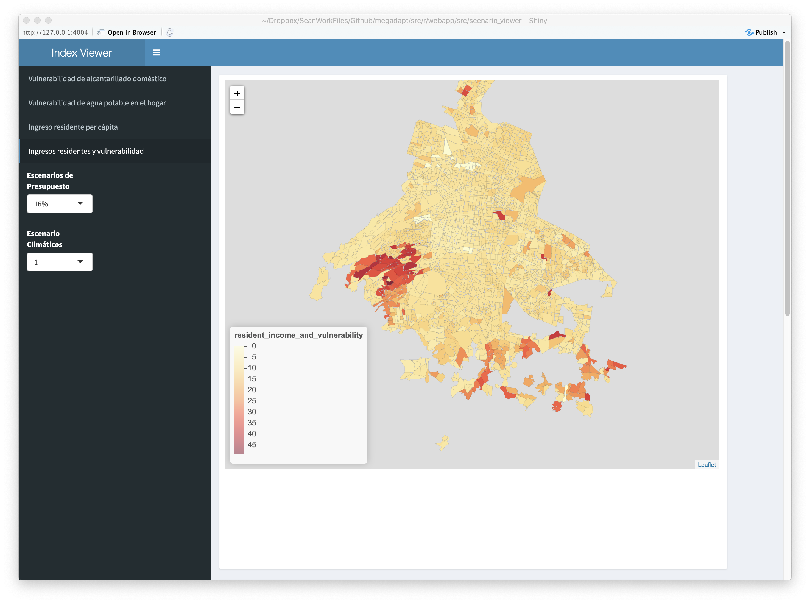

# Introduction

Megadapt is a spatially explicit microsimulation model made for determining the impact of public and private potable water and sewer infrastructure investment on residents and the environment under different climate scenarios and policy regimes. The Megadapt model could be used to determine the impacts of different policy decisions such as budget levels, initial sewer infrastructure capacity, land-use and municipal investment decisions as well as changing environmental conditions. It is applied to Mexico City but the approach was developed thinking about its applicability to other cities as well. The Megadapt model aims to be a participatory model where decision makers, residents and stakeholders can evaluate and self-reflect on the consequences of their decisions and actions.

The infrastructure investment decisions of the municipality and residents impact the environment and resident well-being in the municpality and surrounding area. Potable water infrastructure coverage and quality influences health and private infrastructure investment. Sewer and stormwater infrastructure quality and coverage influences ponding and flooding rates as well as water borne disease rates. Resident and municipal preferences about municipal investment were determined using stakeholder consultations where participants were asked to compare the relative importance of different factors and to describe the relationship between the factor level and desirability. This information was used to construct an Analytic Network Process [@saaty2013analytic] model and value functions.

## Model

The Megadapt model is composed of different subcomponents. Each subcomponent has its own data requirements to function. The climate component requires a panel of precipitation and runoff data by census block. The flooding and ponding models depends on the climate data as well as infrastructure capacity per census block. The water scarcity model depends on infrastructure information (such as water pressure), demographic information, infrastructure failure reports and resident preference data. The resident investment model requires resident preference data (value functions and a mental model) as well as infrastructure data (private and public) and demographic data. The municipal model requires municipal sewer and potable water department preferences, infrastructure data, climate data and demographic data.

`megadaptr` is an R package that implements the Megadapt model and its subcomponents. This vignette goes over how to use the Megadaptr to create a megadapt model, to explore scenarios, visualize results and determine the sensitivity of input parameters such as budget and the infrastructure decay rate on outcomes. 

The relationships between components is shown below

```{r echo=FALSE, message=FALSE}
library('DiagrammeR')
library('ggplot2')
grViz("
digraph megadapt {

  # a 'graph' statement
  graph [overlap = true, fontsize = 10]

  # several 'node' statements
  node [shape = box,
        fontname = Helvetica]
  climate; 
  ponding; 
  flooding; 
  water_scarcity [label='water scarcity']; 
  resident [label='resid invest']; 
  municipality [label='municip invest']
  save_results [label='save results']

  node [shape = circle,
        fixedsize = true,
        width = 0.9] // sets as circles
  apply_climate_changes [label='apply']; 
  apply_data_changes [label='apply']; 
  combine_data_changes [label='join']
  
  node [shape = egg]
  study_data [label='study data']

  # several 'edge' statements
  climate->apply_climate_changes
  study_data->apply_climate_changes
  apply_climate_changes->flooding
  apply_climate_changes->ponding
  
  study_data->municipality
  study_data->resident
  study_data->water_scarcity
  study_data->save_results
  
  climate->combine_data_changes
  flooding->combine_data_changes
  ponding->combine_data_changes
  municipality->combine_data_changes
  resident->combine_data_changes
  water_scarcity->combine_data_changes
  
  combine_data_changes->apply_data_changes
  study_data->apply_data_changes
  apply_data_changes->study_data
}
")
```

There are few interesting timing take aways from the graph. The flooding and ponding models use climate data generated for the current year while the residential investment, municipal investment and residential water scarcity models use climate data from the previous year. All other input data used by the model components is either static or generated from the previous year. The `apply` and `join` nodes in the graph can be thought of as models. The `apply` function takes the study data and some changes to existing study data variables and replaces those variables in study data with those in the changes data set. The `join` function takes many change data sets and joins them together to form a new change data set. It assumes the variables of all change data sets are disjoint (e.g. the ponding and flooding models cannot change the same variables). The `study data` node is a memory component. It has a state that can be set and retrieved.

The `megadaptr` package implements the Megadapt model with code organized around the subcomponents mentioned. There are components for flooding, ponding, residential investment, municipal investment, climate, water scarcity and the Megadapt model as a whole. All components except for the Megadapt model as whole are just functions. The Megadapt implementation has state to keep track of the current census state for that time year as well as the number of years the simulation has been run for. Components in the `megadaptr` package loosely follow the function specified system (FNSS) and discrete time system specifications (DTSS) given in Theory of Modeling and Simulation [-@zeigler2019] except that the model and simulator are not completely seperate.

## Model Components

Detailed information about how the model components work and there data requirements are is described in this section. Information about calling and interacting with individual model components is available in the `megadaptr` package docs.

### Weather

The weather component generates runoff and precipitation values by census block under a given climate and landuse scenario. It is a data generation component that takes a randomly selected year from the chosen climate scenario dataset and returns it. The climate scenario dataset is a census block panel dataset of precipitation and runoff values.

### Ponding

The ponding model generates a ponding index in a census block per year to represent the risk associated to ponding. In consultation with Mexico CIty Secretary of Water Management (SACMEX), the index takes into consideration the following variables :

1. The historic frequency of ponding and floding events.
2. The volume of precipitation.
3. The volume of runoff from mountain watershed, and
4. The capacity of the sewer and storm water system.
  
\begin{eqnarray}
ponding_{index} &=& \sum_{i=1}^{N_p} w_i x_i
\end{eqnarray}  
  
where $w_i$ represents the weigth of the criterio and $x_i$ is a value function of the state of the criterion $i$, for the $i=1, \dots, N_f$ criteria that influence ponding risk.
  
The index returns a value in each census block that should be interpreted as the frequency of events. Agents influence the capasity of the sewer and storm water system, and cliamte change can modify the vilume of precipitation and runoff. We therefore expect that this index will change over time in a simulation of the megadapt model for Mexico City.

### Flooding

The flooding model generates an index of flooding risk in a census block per year. The flooding index is obtained by a weigthed sum of value functions obtained from a set of criteria that describe the spatial variability in flooding risk. The set of criteria are: The historic frequency of flooding events, the valume of precipitation, the capacity of the sewer system, and the volume of runoff. Mathematically the index is defined as:

\begin{eqnarray}
flooding_{index} &=& w_{historic\_flooding\_freq}  fv_{historic\_flooding\_freq}\nonumber\\
&+& w_{f\_prec\_v}  fv_{f\_prec\_v} \nonumber\\
&+& w_{fv\_non\_potable\_capacity} fv_{non\_potable\_capacity}\nonumber\\
&+& w_{f\_esc} fv_{f\_esc}\nonumber
\end{eqnarray}

\begin{eqnarray}
p &=& \sum_{i=1}^{N_f} w_i x_i
\end{eqnarray}


where $w_i$ represents the weigth of the criterion and $x_i$ is a value function of the state of the criterion $i$, for the $i=1, \dots, N_f$ criteria that influence flooding risk.

### Residential Water Scarcity

The residential water scarcity model determines an index of potable water access for a census block.

The water scarcity index is constructed assuming that the risk of a census block to have potable water scarcity is a sum of a set of value functions associated to a set of criteria related to biophisical and infrastructure variables:

1. The population size of the cencus blocks.

2. The reports of the population associated to disruptions in the service.

3. The socio-economic level of the census blocks, which is represented by the asset index in each cencus block.

4. The proportion of houses without connetion to the potable water supply system.

5. The critical areas for deliver potable water by the authority. The difficulties of the the authority has to provide potable to the census blocks.

6. The level of adaptation of the resident, represented by the average number of tanks per resident in each census block.

7. The potential of the censuc block to capture rainfall water.

The index is divided between scarcity associated to the sensitivity of cencus block and to the exposure.

\begin{eqnarray}
scarcity\_exp_{index} &=&  (w_{zonas\_crit})(fv_{zonas\_crit}) + (w_{dias\_sagua})(fv_{dias\_sagua})\nonumber\\
&+& (w_{antiguedad})(fv_{antiguedad}) + (w_{falta\_dist})(fv_{falta\_dist}) \nonumber\\
&+& (w_{presion\_hid})(fv_{presion\_hid})\nonumber
\end{eqnarray}

### Residential Investment

The residential investment model determines how much investment into private potable and sewer infrastructure takes place in a census block in a year. Residents in the census block can make two aggregate actions: they can modify their houses to reduce their sensitivity to exposure to flooding events or they can modify their house to reduce their sensitity to the exposure of water sarcity.

Residents choose between options between sewer and potable water investment by attempting to minimize their distance from an ideal point. Their distance from the ideal point is computed using census block state and value functions that connect the action to a set of criteria from the Analytic Network Process model (ANP model).

For each census block $j$ and action $k$, the calculation of the ideal point $d_{j,t}^k$ is done using the equation described in the document `site_selection_and_site_suitability.Rmd`.

Each time step $t$, the residents in census block $j$ ask the following question: Is $d_{j,t}^k1 >d_{j,t}^k1$?
If, indeed $d_{j,t}^k1 >d_{j,t}^k1$, then the agent chooses action 1 (Reduce the sensitity to the exposure to flooding). If  instead $d_{j,t}^k1 < d_{j,t}^k1$ of action 2 (Reduce the sensitity to the exposure of water sarcity).

### Institutional Investments

The institutional investment model determines where (which census blocks) and how (what action) to invest resources into public potable and sewer infrastructure in a year. Currently the only institution represented in the megadapt model is the Secretary of Water of Management of Mexico City (SACMEX)

The decisions of the institutional agent SACMEX is to select a subset of spatial units that maximized the satisfaction of the agent according to the goal of reducing the vulnerability of the city to water-related crisis. The investment decisions by the socio-institutional agents are accomplished in the model by two sub-routines: site suitability and site selection. Site suitability informs the socio-institutional agent as to the best spatial units for investment, based on the criteria and alternatives of the MCDA model. The site selection procedure then evaluates the different alternatives of spatial units in order to identify the set of spatial units that minimized the dissatisfaction after the investment. These investments involve a set of possible actions taken by the socio-institutional agents, $k={k_1,..,k_m}$. Formally, an investment is defined as a Boolean variable, $y_{jt}^k={0,1}$, where the value $y_{jt}^k=1$ represents that an investment associated with action $k$ has been made in the spatial unit $j$ at time $t$. SACMEX decides in which spatial units to allocate investments associated with infrastructure systems to reduce the risk of exposure to hazards at time $t$ in spatial unit $j$.

#### Site Suitability

An assessment of the census blocks that are prioritized for actions is obtained through multicriteria evaluation of the distance of each census block from an “ideal point,” or utopian state, defined as a set of decision-making criteria and the relative importance of each criterion for the decision makers (Bojórquez-Tapia et al., 2011). Formally, we calculate a distance $d_{jvt}^k$, such that:

$$d_{jt}^{k}={[\alpha^\rho \sum_{i}^{I} w_i^{\rho}  (1-x_{ijt}^{k})^\rho]}^{\frac{1}{\rho}}$$   
where $d_{jt}^{k}$ is the distance to the ideal point of census block $j$ with respect to action $k$; $w_i$ is the criterion weight of criterion $i$, $\alpha$ is the weight of action k; $x_{ijt}$ is the normalized value in a census block $j$ of the attribute corresponding to criterion $i$, with respect to action $k$; $x_{ijt}$ is the departure of an alternative from the ideal point for a criterion. This variable is the standardized score $x_{ijt}$, which represents a judgment about the importance of an observable stimulus (census block attribute value) in the water authority’s decision; $i, j, k, t$, are indices for criteria, census blocks, action, time, respectively. Finally, parameter \rho  is the compensatory parameter that define the metric to compute the distance. With $\rho=2$, the metric is Euclidian. 

#### Site selection

Every year site selection is invoked by the manager for choosing investments y_v^k, in action k in system v, in a specific number of census blocks, established by budgetary constraints B_k. Formally, this involves using a 0-1 (or binary) programming model (Dykstra 1984) in which the objective function maximizes d_jvt^k. In this way, the model simulates a preference for investing in the census blocks where investment in infrastructure system v is most needed. Formally:

\begin{equation*}
\begin{aligned}
& \underset{x}{\text{maximize}}
& & F(y_t^k)=\sum_{j}^{J} d_{jt}^{k} y_{jt}^k \\
& \text{subject to}
& & \sum_j^{J} y_{jt}^k <B_k.
\end{aligned}
\end{equation*}

where $B_k$ is the number of census-blocks where investment related to action k can take place; $y_{jt}^k$ is the 0-1 decision variable for action $k$ in census block $j$ at time $t$ ($y_{jt}^k=1$, if census block $j$ is selected for investment, or 0 otherwise). An implementation of other forms of maximization with a more complete set of constrains is underway.

Budget $B$ represents a total capital or resources divided among census blocks. Thus when $B < J$  there is a limited among of resources to be divided in the city. The budget can be aggregated or disaggregated according to institutional rules. For instance, in CDMX the budget for drainage is separated from the budget for potable water system, and within each system, the budget is divided in actions. The optimization of the objective functions were done using a non-dominant sorting assessment (NDSA) that find solutions near the Pareto frontier.

## Calibrating the Model

Calibration of the Megadapt model was performed using stakeholder and expert knowledge. Stakeholders were asked survey questions to determine the importance of different outcomes on well being and with the aid of visualization tools.

The flooding and ponding models depend on weights assigned to runoff, precipitation, capacity and historical flooding and ponding to evolve flooding and ponding values over time. Since panel flooding and ponding data by census block with necessary explanatory variables was unavailable the flooding and ponding model parameters are estimated by visual inspection of flooding and ponding outcomes.

```{r, eval=FALSE}
# Visualization of ponding and flooding model weights goes here
visualize_calibration(study_area)
```

The municipal investment model was calibrated using survey data and interactive value function calibration workshops. Survey data was used to estimate an analytic network process model of resident and municipality values. This is combined with value functions to give resident and municipality preferences.

## Running the model

The megadapt model constructor is flexible. It allows the replacement of the mental model, climate scenario, study area, flooding model, ponding model and municipal investment model. The simplest way to run the model is

```{r, eval=FALSE}
library('megadaptr')
megadapt <- megadapt_create(params_create())
results <- simulate(megadapt)
```

but if you want the change the municipalities budget, the ponding and flooding model and mental models you could also run the model with

```{r, eval=FALSE}
megadapt2 <- megadapt_create(
  params_create(budget = 400),
  sacmex_fnss_creator = sacmex_fnss_create,
  mental_models = mental_model_constant_strategies(),
  flooding_fnss = flooding_delta_method_fnss_create(),
  ponding_fnss = ponding_delta_method_fnss_create()
)
results2 <- simulate(megadapt)
```

## Determining an Experiment to Run

For experiments to be useful they need to vary parameters that substantively impact simulation run results. The importance of parameters on run results can be determined through sensitivity analysis.

Variance-Based Sensitivity Analysis (VBSA) estimates the impact of input parameters on the uncertainty or variability of the model’s outputs. The analysis runs the model once per combination of input parameters and calculates two coefficients for each input and output of interest (seebelow for details about inputs and outputs). The first-order sensitivity coefficient measures the fraction of the model variance that is due to the changes of a single input, averaged over the variance caused by all the input parameters and their interactions. The total-order sensitivity coefficient shows the fraction of the variance that is caused bychanges to one input and its interactions with other input parameters, again averaged over the unconditional variance of the model.

In this particular implementation, the sensitivity coefficients are estimated using a Quasi Monte Carlo method, according to the procedures explained by Saltelli et al. (2010). Sampling of the parameter space is done using the Sobol’ sequence. The resulting sets of parameters are used to run the different instances of the model and the estimated coefficients are calculated by using the formulas proposed in the publication cited above.

```{r, eval=FALSE}
# Example Running Sensitivity Analysis on HPC goes here
# Using HTCondor
# Using SLURM
# Deployment to HPC
```

## Interpreting Experiment Results

Megadapt model results can be plotted to show how outcomes of interest change in response to a particular input parameter. Package functionality is shown by conducting an simple experiment where only budget and initial capacity vary. Results below show municipal investment levels for sewer and potable water maintenance and new infrastructure over a five year period. An intervention count of five indicates that investments were made every year in that census block while a intervention count of zero indicates no investments were made. The y-axis facet is budget level. A budget level of 200 indicates that 200 census blocks can be covered by the budget in one year and a budget of 1000 means that 1000 census blocks can be covered by the budget in one year.

```{r message=FALSE, warning=FALSE}
# Create a small example database
# A full experiment should include multiple replications of the same parameters but this example does not
conn <- DBI::dbConnect(RSQLite::SQLite(), 'ex2.db')
if (!fs::file_exists('ex2.db')) {
  params_df <- megadaptr:::params_cartesian_create(megadaptr::params_create(budget=1:5*200))
  megadaptr:::params_table_create(conn, 'ex', params_df)
  megadaptr:::results_table_create(conn, 'ex', params_df)
}

params <- dplyr::tbl(conn, 'ex_params')
results <- dplyr::tbl(conn, 'ex_results')

# Create a simple plot function to compare model municipal investment outcomes
experiment_map_plot <- function(experiment_df, study_area) {
  fortified <- fortify(study_area, region ="censusblock_id")
  fortified$censusblock_id <- fortified$id

  ggplot() +
    geom_map(data=experiment_df, map=fortified,
             aes(fill=statistic_value, map_id=censusblock_id)) +
    expand_limits(x=fortified$long, y=fortified$lat) +
    xlab('Budget') +
    ylab('Statistic') +
    scale_fill_viridis_c() +
    facet_grid(cols = vars(budget), rows = vars(statistic_name)) +
    labs(fill = 'Intervention Count')
}
```

Since the experiment we just ran only changed budget values but left everything else constant it makes sense to plot different outcomes from varying the budget. Each budget value is sampled multiple times in order to determine the impact of weather variation on outcomes. Household vulnerability to potable and sewer water systems, household investments, municipal investments and infrastructure capacity are shown in plots faceted by budget level below. 

```{r message=FALSE, warning=FALSE, fig.height=8, fig.width=10}
experiment_df <- megadaptr:::experiment_map_df(results, params, facets = rlang::sym('budget'))
study_area <- megadaptr::study_area_read('../inst/rawdata/censusblocks/megadapt_wgs84_v5.gpkg')
experiment_map_plot(experiment_df, study_area)
```

Interactive visualization of model results will be done using the `visualize` function (WIP). Below shows a visualization of the resident income and vulnerability index.

```{r eval=FALSE}
visualize_results(experiment_df)
```



## Extending the Model

Creating a new component for the megadapt model requires:

### Constructor

Model components in the package all have constructors. Constructors take some configuration and return an instance of model component with a particular class and superclasses. To reduce the number of S3 methods needed when creating the a model the `prepend_class` function is used. It takes a value and class name and adds the class name to beginning of the value's class list. This makes it possible to use S3 methods from the model's base class such as `print`.

### Model Interface

All models in the `megadaptr` package except the overall `megadapt` object implement the function specified system (FNSS) formalism. In FNSS a model component is stateless and returns an output given input. The `megadapt` model is based around the Moore discrete time specificied system specification (Moore-DTSS). The Moore-DTSS formalism is more complex since it deals with timing and state. It is given by

The DTSS formalism has state and is given by

$$
\begin{align}
X&:       \text{input set} \\
Y&:       \text{output set} \\
S&:       \text{state set} \\
\lambda&: S \rightarrow Y \text{ is the output function }\\
\delta&:  S \times X \rightarrow Y \text{ is the transition function}\\
c&:       \text{constant time step size}
\end{align}
$$
For the Megadapt model $X$ is the empty set, $Y$ is the set of all possible study area summaries, $S$ is the set of all possible study area states,  $\lambda$ is described by the data collector subcomponent, $\delta$ is combination of the  climate, flooding, ponding, municipal investment, residential investment and water scarcity models connected $c$ is a year, 

### Study Area Initialization

Model components have an optional study area initializer. Initialization of the overall `megadapt` model instance state requires initial values for some variables used in the model subcomponents such flooding, municipal investment etcetera. Where these values are not provided in the initial study area dataset they are initialized in a model component's initialization function. In order to keep code easy to read if two or more components require a particular variable it is better to that variable's initialization in the common Megadapt initializer.

### Change or Create New Parent Megadapt Component

Since the model component likely has configuration the `megadapt` model initializer, transition function and output function must be changed and created to accomodate the new model. These changes will involve adding calls to the initializer in the initialization function `megadapt_initialize`, adding calls to the component in the transition function `transition_dtss.megadapt_dtss` and summarizing any state from the model output in the data collector component for later analysis.

## References
